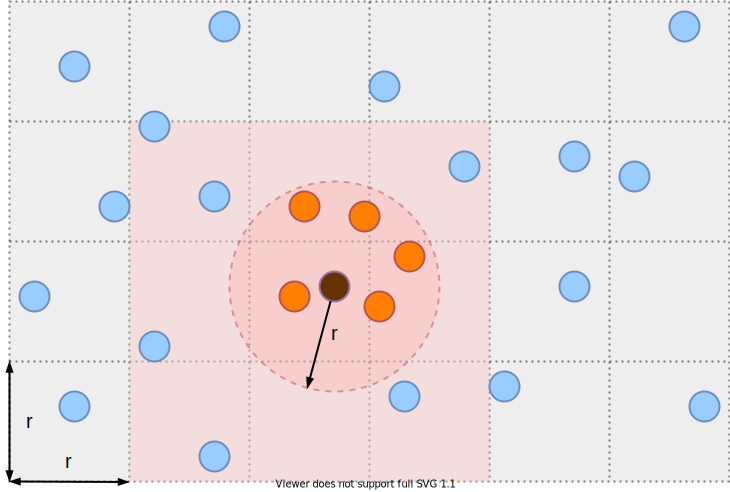

# CellLists.jl


[](https://jaantollander.github.io/CellLists.jl/dev/)


## Description
`CellLists.jl` is an algorithm that solves the fixed-radius near neighbors problem. That is, it finds all pairs of points that are within a fixed distance apart from each other. Additionally, I wrote an article [*Searching for Fixed-Radius Near Neighbors with Cell Lists*](https://jaantollander.com/post/searching-for-fixed-radius-near-neighbors-with-cell-lists-algorithm-in-julia-language/), which explores the Cell Lists algorithm and theory behind it more deeply.


## Installation
Currently, the package is unregistered. You can install it from GitHub.

```
pkg> add https://github.com/jaantollander/CellLists.jl
```


## Example
We can use `CellLists.jl` by supplying `n`, `d`-dimensional points, and fixed radius `r` to the `CellList` constructor.

```julia
using CellLists: CellList, near_neighbors, distance_condition
n, d, r = 10, 2, 0.1
p = rand(n, d)
c = CellList(p, r)
```

By calling the `near_neighbors` function, we obtain a list of index pairs of points that are within `r` distance.

```julia
indices = near_neighbors(c)
```

```julia
[(3, 6), (4, 5), ...]  # indices
```

We can compare Cell Lists to the brute force method.

```julia
indices2 = Vector{Tuple{Int, Int}}()
for i in 1:(n-1)
    for j in (i+1):n
        if distance_condition(p[i, :], p[j, :], r)
            push!(indices2, (i, j))
        end
    end
end
```

The outputs should be equal as follows:

```julia
@assert Set(Set.(indices)) == Set(Set.(indices2))
```

On average, the Cell List algorithm is more efficient than brute force when dimensions `d` is small, the number of points `n` is sufficiently large, and radius `r` is small compared to the bounding box of the points. Benchmarking section discusses how to benchmark instances to compare performances.


## Benchmarking
We can benchmark instances of Cell List agains brute force. First, we define the benchmarking functions.

```julia
function brute_force(p::Array{T, 2}, r::T) where T <: AbstractFloat
    ps = Vector{Tuple{Int, Int}}()
    n, d = size(p)
    for i in 1:(n-1)
        for j in (i+1):n
            if @inbounds distance_condition(p[i, :], p[j, :], r)
                push!(ps, (i, j))
            end
        end
    end
    return ps
end

function cell_list(p::Array{T, 2}, r::T) where T <: AbstractFloat
    c = CellList(p, r)
    return near_neighbors(c, p, r)
end
```

We will use [BenchmarkTools.jl](https://github.com/JuliaCI/BenchmarkTools.jl) for benchmarking.

```julia
using Random, BenchmarkTools
n, d, r = 100, 2, 0.01
p = rand(MersenneTwister(123), n, d)
```

Next, we run the benchmarks for `cell_list` and `brute_force` functions.

```julia
julia> t1 = @benchmark cell_list($p, $r)
BenchmarkTools.Trial:
  memory estimate:  47.11 KiB
  allocs estimate:  635
  --------------
  minimum time:     78.103 μs (0.00% GC)
  median time:      79.670 μs (0.00% GC)
  mean time:        82.669 μs (2.86% GC)
  maximum time:     2.702 ms (94.47% GC)
  --------------
  samples:          10000
  evals/sample:     1
```

```julia
julia> t2 = @benchmark brute_force($p, $r)
BenchmarkTools.Trial:
  memory estimate:  1.36 MiB
  allocs estimate:  14850
  --------------
  minimum time:     364.960 μs (0.00% GC)
  median time:      367.289 μs (0.00% GC)
  mean time:        397.621 μs (7.15% GC)
  maximum time:     1.579 ms (76.08% GC)
  --------------
  samples:          10000
  evals/sample:     1
```

We can compare the median execution times times and memory usage.

```julia
julia> ratio(median(t1), median(t2))
BenchmarkTools.TrialRatio:
  time:             0.21648868237276161
  gctime:           1.0
  memory:           0.03383838383838384
  allocs:           0.04276094276094276
```

```julia
julia> judge(median(t1), median(t2))
BenchmarkTools.TrialJudgement:
  time:   -78.35% => improvement (5.00% tolerance)
  memory: -96.62% => improvement (1.00% tolerance)
```

As we can see, Cell List performs much better on this instance than brute force.


## Multi-Threading

```bash
export JULIA_NUM_THREADS=2 && julia
```

```julia
CellList(p, r, Val{:parallel})
```
